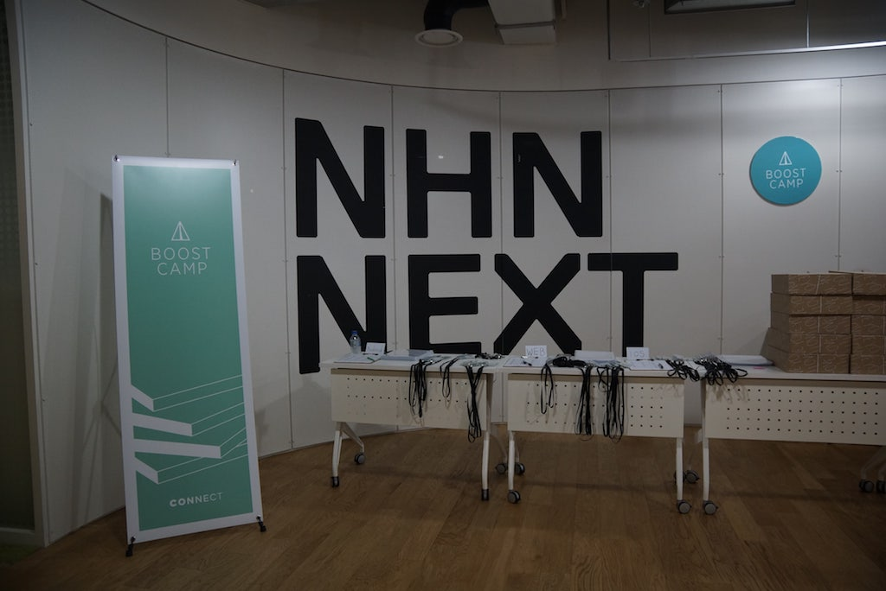

# Boostcamp 2 기 Web 과정 회고

엄청나게 늦은 회고지만 다음 기수를 위해서 예전에 적어 놓았던 회고를 약간 수정해서 공유하기로 마음먹었다.
다음 기수의 커리큘럼을 짐작할 수는 없어서 도움이 될지 모르겠지만 현재 다니고 있는 직장도 부스트캠프 출신이라서 기회를 얻을 수 있었고, 이 회고록도 그때 처음 써본 것이기 때문에 엄청 서툴게 썼던 것 같다. 앞으로의 회고도 틈만나면 작성을 해볼 예정이다. 그렇게 하기 위해서는 기록을 잘해야겠지...

## 시작하며

부스트캠프는 첫째 주와 마지막 주를 제외한 나머지 6 주 동안 쉴 틈 없이 개발에만 집중할 수 있는환경을 만들어 주었고, 6 주동안 시간이 얼마나 빨리 가는지 정말 말 그대로 부스트했다. 프로젝트를 진행하면서 필요한 개념이나 기술에 대한 것들은 튜터님들의 강의나 질문들을 통해서 대부분 해결되었다.
나는 FE 에 관련된 기술들에 관심이 많아서 그런지 FE 쪽에서는 모듈화와 컴포넌트 제작 그리고 자바스크립트의 동작 과정및 브라우저의 동작 과정 등 웹 개발자라면 알아 할 지식을 배우면서 신세계를 경험함과 동시에 내가 아직 많이 부족함을 느꼈다.

## 코드로 하는 커뮤니케이션

부스트캠프를 통해서 가장 많이 도움이 되었던 것을 꼽으라면 당연히 코드 리뷰다.
혼자서 개발을 할 때 가장 힘들었던 부분 중 하나가 이게 맞는 건지에 대한 확신이 없다는 것이었다.
구글링을 통해서 이런 확신을 간접적으로 하곤 했었는데, 직접적으로 튜터님들과의 코드리뷰를 진행하면서 피드백을 받다보니 정말 좋았다. 사실 막상 누군가 나의 코드를 본다고 생각하면 굉장히 창피할것 같았는데, 직접 경험해보니 튜터님들이 코드를 지적한다는 느낌보다는 더 나은 방법을 제시해주고,
틀린 방법들을 바로 잡아주면서 퀄리티가 나아지도록 이끌어 주는 형식으로 진행이 되었기 때문에 그런 일은 없었다.
‘실제로 여러분들이 코드를 작성하는 시간보다 누군가 작성한 코드를 보는 시간이 더 많다’라고 하는튜터님들의 조언들을 생각난다. 때문에, 코드를 작성 할 때에는 누군가가 내 코드를 보면서 이해하기쉽고, 읽기 쉽도록 작성한다는 것이 좋다고 생각한다.
이해하기 쉽고 읽기 쉬운 코드를 작성하는 것 또한 다양한 지식과 노하우를 필요로 하므로, 개인적으로 여러 방면으로 공부를 해야 한다. 또, 다른 사람들이 작성한 코드를 많이 보고, 또 개인 프로젝트를진행하면서 다른 사람들이 볼 수 있는 Public 한 Git Repo 에 프로젝트를 등록하는 습관을 들여야겠다고 생각했다.

## 뜻밖의 Open Source Project

부스트캠프에서 진행했던 프로젝트 코드는 Git 을 통해 관리가 되고, 과제는 PR 로 제출하는 형식이었다.
개인적으로 Git 을 사용하도록 노력하고 있었기 때문인지 개인 프로젝트를 진행하는 데에는 문제가 없었는데, 문제는 팀 프로젝트를 하면서 생겼다. 여러 개의 브랜치를 만들어서 진행하고부터 Conflict 가나게 되었는데, 의도한 바는 아니지만 그래도 충돌을 해결하는 과정에서 많은 공부가 되었던 것 같다.
그렇게 약간은 애매한 반쪽짜리 Git 경험을 사용해 볼 기회가 찾아왔다. 그렇게 개발자에게 좋다는 오픈 소스 프로젝트참여이다.
Univ Color 라는 오픈 소스 프로젝트에 참여하게 되었는데, 대학교의 Primary Color 를 Hex Code 로 나타내주는 페이지로 간단한 아이디어의 오픈 소스 프로젝트이다. 부스트캠프에서 배웠던 것들로 충분히할 수 있을 것 같아서 과감하게 PR 을 날렸었다. 결과적으로 프로젝트 특성상 간단한 구조로 이루어져

있었기 때문에 약간의 버그나 구조를 깔끔하게 잡는 정도로 끝이 났지만 그동안 배웠던 것을 토대로이렇게 오픈 소스 프로젝트 경험이 나에겐 자신감을 얻을 수 있는 계기가 된 것 같다.
잠깐이지만 오픈 소스 프로젝트 참여 활동을 통해서 얻는 이점이 많다고 느꼈기 때문에 앞으로 조금더 활발하게 오픈 소스 프로젝트를 찾아보고 참여할 수 있도록 노력하려고 한다.

## 페어프로그래밍에 대한 경험

개인으로 프로젝트를 수행한 이후 팀 단위로 다시 개발하는 시간이 주어졌다. Trello 를 이용해서 공통적인 이슈들을 공유하고 현재 진행 상황들을 간략하게 문서화 하여 공개하므로써 커뮤니케이션 비용을절감하였다. 하다 보니 진행하면서 생겨나는 이슈에 대해 정리를 하는 개념으로 많이 사용되기도 했다.
페어프로그래밍을 진행하면서 생각지 못했던 이슈들이 터져나왔고 이러한 이슈들을 팀원들과 토론을하면서 이슈들을 해결해 나가면서 약간은 모호했던 개념들에 대해 팀원들과 토론을 하면서 확실하게이해할 수 있는 시간이 된 것 같다. 내가 작성할 때에는 발견하지 못했던 어색한 코드들 잘못된 코드들을 팀원들이 발견하면서 조금 더 에러를 덜 발생시키고 이전에 개인적으로 진행했던 코드보다 좋은퀄리티의 코드가 나올 수 있었던 것 같다. 다시 개발하면서 좋았던 점은 그동안 시간이 촉박해서 적용해보지 못한 것들을 리빌딩하면서 적용해보았고, 팀원들과 소통하면서 서로 다른 스타일들을 경험하는것이 좋았다.

## 이해와 원리중심의 개발

나는 BE 쪽 보다는 FE 쪽이 더 재밌었고, 관심이 많았기 때문에 프로젝트를 진행하면서 FE 쪽에 힘이실렸던건 사실이다. (실제로 BE 보다 FE 쪽에 구현해야 할 기능들이 상대적으로 많기도 했다.) Nodejs 외에 다른 웹서버를 구축하는 것은 해본 적이 없기 때문에 스프링은 처음 접해보는 프레임워크였다.
그래서 스프링 프레임워크가 가져다주는 이점을 제대로 사용하기 위해서는 알아야 할 개념들이 많이있었는데, 이전에는 이러한 개념들을 정확하게 파악하지 않고 제대로 동작하는 코드만 작성하는 데에그쳤다. 하지만 이렇게 사용을 하게 된다면, 개발자가 의도하지 않는 방식으로 프로그램이 흘러갈 수있고, 그렇게 된다면 퍼포먼스의 영향을 미칠 수 있으며 버그나 에러의 원인이 되기도 한다.
그렇기 때문에, 어떠한 기술을 사용할 때에는 먼저 그 기술에 대한 이해와 어떠한 문제점들을 보완하기 위해서 이런 기술들이 나왔는지, 어떻게 사용을 하는지에 대한 정확한 이해와 프로그램이 동작하는원리를 파악하는 것이 중요하다고 생각하게 되었고, 이를 바탕으로 어떠한 기술들을 사용하는 데에 필요한 개념들을 정확하게 파악해서 조금 더 효율적이고 유연하게 코드를 작성하는 개발자가 되고 싶다.

## 마치며

지난 7 월부터 8 주간 진행한 부스트캠프는 나에겐 더없이 좋은 기회였고, 지식을 더 높게 쌓을 수 있는기반을 다져준 기간이었다.

‘모자라는 부분을 채워가는 것이 행복이다.’라는 말처럼 아직은 부족하지만 부스트캠프를 통해서 부족한부분을 채워가는 과정이 즐겁고 행복했다.
