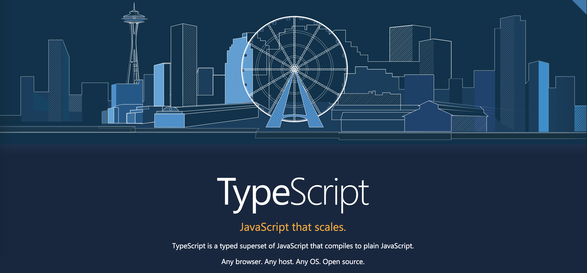

# TypeScript Meetup 2018-1



타입스크립트를 사용한지 이제 막 3 개월 째, 걸음마 떼자마자 좋은 기회로 찾아온 Typescript Meetup!
TypeScript Korea 에서 활동중인 분들께서 열심히 준비해주신 밋업인 만큼 유익한 자리가 될 것 같은 기대감이 들었다.

이번 TypeScript Meetup 은 저녁 7 시부터 9 시까지 각 세션당 30 분정도의 시간이 주어지고 총 4 개의 세션으로 준비되어 있었다.

## 첫 번째 세션 손찬욱님 (NAVER) - TypeScript 로부터 얻은 것과 잃은 것


[egJS](https://naver.github.io/egjs/)라는 Open Source Library 에 Typescript 를 도입하면서 겪었던 경험담에 대해서 들을 수 있었다. 오픈소스로 진행된 egJS 는 이전에 부스트캠프를 진행하면서 library 로 사용해보았기 때문에 굉장히 반가웠다. egJS 의 모든 것에 Typescript 를 적용한 것 같지는 않고, 예를 들어주신 부분이 [Axes](https://naver.github.io/egjs-axes/)라는 모듈이다. 사용자의 인터렉션에 따라서 다양한 입력 장치로 사용자 작업 정보를 가상 좌표로 변경하는데 사용하는 모듈인데 자세한 내용은 링크로 확인하시라. 이 모듈에 Typescript 를 적용하셔서 얻게 된 부분은 첫 번째로 `타입이 주는 이점` 이다.

어떻게 보면 당연하다 나도 Type 이 주는 이점이 굉장히 크다고 평소에도 생각을 해왔기 때문이다. 런타임에서의 오류를 컴파일타임에서 막아주기도 하고, IDE 가 발전하면서 (특히 VSCode 짱짱맨) TypeScript 내부에서 클래스와 메서드를 왔다 갔다 하면서 코드를 볼 수 있으므로 개발 생산성 및 안전성이 좋아질 수 밖에 없는 것 같다.

Library 를 만들면서 내부적으로 겪었던 경험들을 소개하시다가 `third part module`에 대한 이야기를 하셨는데 꽤 흥미로웠다. 모듈의 로딩에서 **UMD 방식과 CommonJS 방식**을 `import`구문을 이용해서 사용할 때, babel 을 사용했을 때와 Typescript 를 사용했을 때 다르게 동작한다는 사실!

```js
// babel commonJS 모듈 로딩 방식
import HammerJS from 'hammerjs';

// typescript commonJS 모듈 로딩 방식
import * as HammerJS from 'hammerjs';
```

아래의 `* as Module` 부분이 ES2016 에서 정의된 *표준 스펙*이다. 따라서 Typescript 가 제대로 구현하고 있는 것이고, Babel 이 저렇게 해도 동작이 되는 이유는 transpile 할 때 Babel 이 내부적으로 default 로 모듈을 지정해주기 때문이다. babel 을 먼저 사용하다가 Typescript 로 넘어오신 분들이 가장 많이 공감했던 것 같다.

이 차이점을 조금 더 보태서 설명하자면 Library 들은 보통 AMD, UMD, CommonJS 이 세가지 방식 중에 한두가지 혹은 세가지 모두 지원하게 되는데 혹시 Library 내부적으로 모듈을 export 하는 과정에서 `defaults`가 존재한다면, Babel 과 같은 import 구문으로 사용할 수 있고, `defaults`가 아닌 `export 변수 | 모듈`로 지정이 되어있다면 Typescript 와 같은 방법으로 로딩을 할 수 있다.

한마디로 위 두개의 가장 큰 차이점은 `export defaults HammerJS` VS `export const HammerJS = hammerModule` 이다.

또 `third part module`을 불러오면서 `@types`에 대한 언급도 하셨는데, 잘 만들어진 혹은 유명한 라이브러리들은 대게 `@types`라는 DefinitelyTyped 에서 제공하는 type 과 module 의 코드상 type 이 맞질 않는 경우가 생기거나 코드 일부분만 타입이 작성되어있거나 한다고... 이 때, 직접 `d.ts` 파일을 만들기도 하거나 혹은 DefinitelyTyped 에 PR 을 통해서 자신이 사용하는 Library 들의 `@types`를 정의 할 수 있다.

Typescript 자체적인 문법의 러닝커브는 높지 않다고 생각하는데 `generic`이 여러 번 들어가거나, function 의 타입을 리턴 혹은 인자로 받아서 type 을 정의한 코드를 예제로 보았는데 진짜 보기 힘들었다. 그만큼 유용한 기능들을 너무 압축시켜서 사용하거나 여러 번 사용하게 된다면 분명 코드를 읽는 사람들이 어려움을 겪을 수 있다. 그게 자신이 될 수도 있는...

회사의 특성상 IE8 을 지원해야 하는 상황에서 Babel 에서의 `ES3`로의 transpile 이 생각보다 간단하지 않았고 Typescript 에서는 tsconfig.json 에 target 만 바꿔주면 쏘 이지하게 ES3 로 코드가 translate 되기 때문에 굉장히 만족했다고 한다.

## 두번째 세션 김상원님 (Tumblbug) - 코드 한 줄 없는 Typescript 사용기


[발표자료](http://slides.com/pueue/ts#/)를 넘나 잘 만들었다. 짤방에 취하는 그런 발표자료인 것 같다. 이분은 1 년 차 개발자라고 하시는데 발표를 너무나도 잘해주셔서 보기 좋았던 것 같다. 사내에서 React 를 사용하고 계시고 혼자서 빠르게 웹 서비스를 구축하고자 Typescript 를 선택했다고 한다.

첫 번째로 `빠른 디버깅`을 꼽으셨는데 전적으로 동의한다. 일단 Type checking 이 런타임시 나타나는 `xxx of undefined`, `xxx is not function` 등의 오류들을 미리 막아 줄 수 있으므로 Type checking 이 한 몫했다고 생각한다.

두 번째로 `적지만 믿을 수 있는 코드`인데 이것도 Type Checking 이 가져다 주는 이점이다. JS 를 통해서 코딩을 하다 보면 해당 파라미터로 넘어오는 인자나 리턴된 값에 대한 validation 코드를 작성하기 마련인데 (혹은 Test case 작성) Typescript 는 이러한 코드를 줄여준다.

세 번째로 `마음 편안한 refactoring`인데 음.. 이것도 Type Checking 이 크다고 볼 수 있는데 개인적으로 나는 이게 Typescript 뿐만 아니라 코드를 작성하는 IDE 의 성능 향상도 어느정도 영향이 있다고 생각한다. VSCode 같은 경우도 함수를 참조하고 있는 파일들의 목록 혹은 해당 코드 블럭을 Preview 로 보여준다던가, rename 을 통해서 모든 함수의 이름을 변경한다던가에 대한 것들은 전적으로 IDE 가 잘 해주기 때문이라고도 생각한다. 물론 함수들의 input/output 의 타입이 지정되어있기 때문에 이를 바탕으로 리팩토링을 조금 더 수월하게 할 수 있는 것도 전적으로 동의한다.

네 번째로 `코드 === 문서`인데 이 부분은 어느 부분은 그럴 수도 있지만, 조금 복잡한 어플리케이션이 된다면? 코드만 보고 이해하는 데 있어서 어려움이 있지 않을까 생각한다.
음... 내가 아직 지식이 얇아서 그런 걸 수도 있다. 확실히 Code 만으로도 어느 정도의 문서화가 되는 부분이 있긴 한 것 같다. 예를 들어서 interface 에 대한 정의 자체가 문서가 될 수도 있고 음... 잘 만들어진 변수명과 구조화가 잘 되어있다면 그 자체만으로 코드가 문서가 될 수 있지 않을까 생각한다.

Typescript 를 실 서비스에 적용하면서 겪었던 경험들에 대한 소개와 장/단점들에 대해 발표하셨는데 사실 이분의 발표를 듣고 많은 자극이 된 것 같다.
또 팀원간에 신뢰는 곧 `실력`이라는... 나도 입사한 지 얼마 되지 않았기 때문에 문득 나는 과연 우리 팀에 신뢰를 얻고 있을까 하는 생각이 떠올랐는데 아직은 그렇지 않은 것 같다. 그래서 그런지 살짝 우울할 뻔했는데 이분의 발표가 나에게 많은 자극이 된 것 같다.

## 세번째 세션 한승호님 (에멘탈) - Typescript 개발 문화


Typescript 를 2 년 동안 실 서비스를 적용하고 개발하기까지의 스토리를 소개해주셨다. Javascript 가 과연 주 언어가 될 수 있을 것인가에 대한 선택에서 Typescript 라는 것을 알게 되었고 이 후 Typescript 를 주력으로 사용하셨다고 한다.

엔터프라이즈급의 웹 서비스를 위해서 Angular Framwork 를 선택하셨고 Angular 가 Typescript 를 기본 언어로 채택하기 전부터 이미 Typescript 를 도입하셔서 래핑해서 쓰셨다고 한다.

나는 Angular1 에 대한 좋지 않은 기억들이 약간 있으므로 그리 좋아하진 않지만 이렇게 대규모의 웹 서비스를 구축하고, ionic2 를 사용해서 모바일앱까지 만드셨다고 하니 대단스했다. `hapi.js`라는 nodejs server framework 에 대해서는 이번 발표를 통해서 처음 알게 되었는데 사실 express 를 주로쓰고 koa 도 많이들 사용하던데 hapi 는 처음 들어봤지만 아이콘이 넘나 귀여워서 한번 들어가 봤다.

전체적인 발표 흐름이 에멘탈 서비스를 구축하는 데 대한 소개에 초점이 맞춰져 있었던 것 같아서 약간 아쉬웠다.

## 네번째 세션 최종욱님 (후이서울(트릴리어네어)) - React with Typescript


마지막 세션으로 React 와 함께하는 Typescript 에 대한 세션이였는데, 발표를 너무 위트있고 스무스하게 진행하셔서 좋았다. React 에 대한 간략한 소개와 어떻게 동작하는지에 대한 설명을 하고 Typescript 와 함께 쓴다면 어떤 이점이 있는지에 대한 것들을 Live Coding 을 통해서 (와우!) 보여주셨는데 정말 준비를 많이 하셨다는 느낌을 받았다. 중간중간 깨알같은 채용 공고는 덤

React 에서의 Component 간 통신을 위핸 prop 및 state 에 대한 Type 들을 지정해서 Component 간에 통신 rule 을 정하고 나서 시작 하는 것과 JS 에서의 일단 넣고 끼워 맞추기 형식으로 코딩을 하는 방식에서 오는 차이점에 관해서 설명을 해주셨는데 거기에 live coding 까지 더해지니 이해가 좀 더 잘되고 좋았던 것 같다.

나중에 `mobx-state-tree`에 대한 기술 소개가 듣고 싶어졌다. 음.. React 공부를 해야겠다는 생각이 들게 해주는 세션이었던 것 같다.

## 마치며


앞서서 발표하신 첫 번째 세션의 찬욱님도 문서화가 따로 필요 없어졌다. 라는 말씀을 하셨고 상원 님이 Typescript 를 사용하면서 꼽은 장점 중에 코드 === 문서라는 말이 있었는데 현재 나는 우리 프로젝트의 문서화 작업을 하고 있으므로 코드를 좀 더 심도 있게 봐야 하지 않았을까 하는 생각이 들었다.

Typescript 를 사용하면서 느꼈던 장점들은 준비된 세션을 들으면서 많이 공감되었다. 내가 Typescript 를 많이 그리고 깊게 다뤄보지는 않았지만, 대부분 사람들이 느끼는 장/단점들이 내가 생각했던 것들과 비슷한 것 같다. 이외에도 많은 장/단점들이 있겠지만 TypeScript 는 분명히 좋은 언어이고 Javascript 를 사용해봤다면 충분히 배움을 시도해볼 만한 가치가 있는 것 같다.

앞으로 Typescript 를 고오급지게 많이 접하도록 노력을 많이 해야겠다는 생각도 들었고 Typescript Korea 에서 이번 TS Meet up 준비하시느라 고생하신 Organizer 분들에게 감사하고 좋은 발표자료와 멋진 발표를 해주신 스피커 여러분께 감사하다는 말씀 전하고 싶다.

다음 Meet up 분기 때는 더 많이 빨아먹을 수 있게 성장해야겠다.
